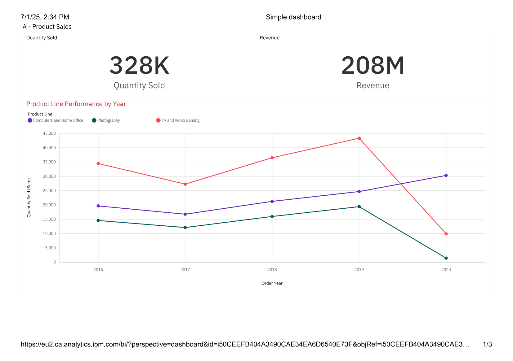
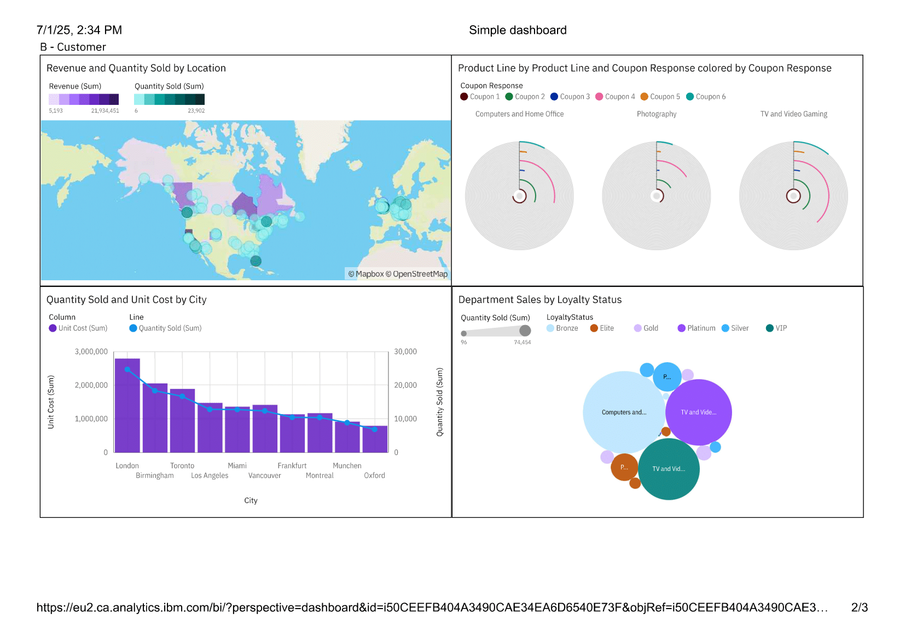

# 📊 IBM Cognos Analytics: Sales and Customer Insights Dashboard
I developed this interactive dashboard using IBM Cognos Analytics to explore product sales and customer data. The dashboard includes multiple pages with dynamic visualizations such as bar charts, maps, packed bubbles, and radial charts. Users can compare product performance by year, view revenue and quantity sold, and analyze customer distribution across locations. I also implemented advanced features like custom calculations, icon-based visuals, data filtering, and navigation paths to enhance interactivity and usability.

---

## 🔹 Page 1: Product Sales Overview

This page summarizes the total quantity sold and revenue generated across three product lines over five years. A KPI widget highlights overall sales (328K units and 208M revenue), while the line chart visualizes product performance over time by category (TV and Video Gaming, Photography, and Computers & Home Office). This enables year-over-year trend analysis and supports multi-product comparisons. Color encoding and axis scaling were applied to clarify differences in volume and growth.

---

## 🔹 Page 2: Customer Analysis

This page incorporates a variety of chart types to explore customer-related metrics:
- **Map**: Displays geographical distribution of sales volume and revenue by region.
- **Radial charts**: Created using both Cognos Assistant and manual methods to visualize coupon response rates by product line and response category.
- **Bar + Line combo chart**: Shows quantity sold and unit cost by city, enabling dual-axis comparison.
- **Packed Bubble chart**: Highlights department sales segmented by loyalty status, using size and color to encode quantity sold and customer tier (Bronze to VIP).

These visuals were designed to enable regional, behavioral, and loyalty-driven segmentation analysis.

---

## 🔹 Page 3: Advanced Dashboard Capabilities

This page demonstrates advanced Cognos dashboard features and customization techniques:
- **Icon-based KPIs**: Custom icons were used to represent revenue brackets, introducing visual encoding beyond standard text/KPI widgets.
- **Conditional formatting**: Revenue bars are colored by location code (urban vs rural) to distinguish distribution performance.
- **Calculated fields**: KPIs like margin were derived from existing measures and formatted for clarity.
- **Interactive filtering and navigation paths**: Users can drill into specific product lines, cities, or years.
- **Multi-layer bar charts**: The margin breakdown by order year and product line showcases stacked comparisons and trend visibility.

These techniques leverage Cognos' full dashboarding capabilities, including property editing, dynamic interaction, and modular report design.

---

## 🔧 Tools Used

- **IBM Cognos Analytics 11.x**
- Cognos Assistant (for AI-generated chart suggestions)
- Custom visualization elements (e.g., icons, calculated fields)
- Manual chart configuration and data field manipulation

🔗 IBM Cognos Embed Link (accessible only with proper credentials):
<iframe src="https://eu2.ca.analytics.ibm.com/bi/?perspective=dashboard&amp;pathRef=.my_folders%2FCustomer%2BLoyalty%2BProgram&amp;closeWindowOnLastView=true&amp;ui_appbar=false&amp;ui_navbar=false&amp;shareMode=embedded&amp;action=view&amp;mode=dashboard&amp;subView=model00000197aba8750f_00000002" width="320" height="200" frameborder="0" gesture="media" allow="encrypted-media" allowfullscreen=""></iframe>
